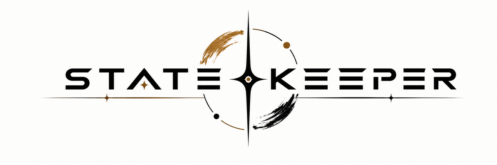

<p align="center">
  
</p>

<h3 align="center">Persistent project memory for Claude Code</h3>

<p align="center">
  Stop re-explaining your project every session. <code>Statekeeper</code> gives Claude a structured, self-updating memory —
  so it picks up exactly where the last session left off.
</p>

<p align="center">
  <a href="LICENSE"></a>
  
  
</p>

---

## The problem

`CLAUDE.md` is one file trying to be everything — project overview, live status, decision log, and history, all mixed together. That either makes it huge and stale, or people stop maintaining it. Either way, every new session starts the same way: you re-explaining what the project is, what's already been decided, and what you were in the middle of.

## What Statekeeper does

Statekeeper replaces that single file with a small, purpose-built `.statekeeper/` folder that Claude reads in full at the start of every session and **keeps up to date automatically as you work** — no reminders needed.

```
.statekeeper/
├── PROJECT.md        # what it is, tech stack, architecture, conventions — rarely changes
├── REQUIREMENTS.md   # functional / non-functional requirements, acceptance criteria
├── ROADMAP.md        # phases/milestones, key decisions and why, deferred items
├── STATE.md          # LIVE status: in progress, not-yet-verified work, blockers, next steps
├── COMPLETED.md      # append-only log of *verified* finished work, newest first
├── convo-1.md        # transcript of session 1, appended incrementally as it happens
├── convo-2.md        # transcript of session 2
└── convo-N.md        # ...one per session, flushed early if context usage climbs
```

If a `.planning/` folder from another planning tool (e.g. GSD) already exists, Statekeeper skips creating `PROJECT.md`/`REQUIREMENTS.md`/`ROADMAP.md` and only owns `STATE.md`, `COMPLETED.md`, and `convo-N.md` — see [Coexisting with other planning tools](#coexisting-with-other-planning-tools-eg-gsd).

## See it in action

**Session 1** — you ask Claude to build something. No `.statekeeper/` folder exists yet, so Claude offers to create one, then works as usual.

```
You:    Add JWT-based login to the API

Claude: [implements auth, writes tests, runs them — all pass]

Claude: Feature's done and verified — updated state and logged today's session.
```

Behind the scenes, Claude rewrote `.statekeeper/STATE.md`:

```markdown
# Current State
_Last updated: 2026-09-15_

## In progress
- Authentication — JWT login shipped and verified; OAuth not started

## Implemented but not yet verified
- (none — JWT login's test suite ran and passed before this was logged)

## Blockers
- None

## Next steps
1. Add Google OAuth as a second login method
2. Add refresh-token rotation
```

and appended a line to `.statekeeper/COMPLETED.md` — note it names *how* it was verified, not just what was written:

```markdown
## 2026-09-15
- Implemented JWT-based login — verified: test suite run, 14/14 passing
```

If the tests hadn't been run yet, that line would stay in `STATE.md`'s "Implemented but not yet verified" list instead — it doesn't get to `COMPLETED.md` until something actually confirms it works. That distinction is deliberate: a log of only successes can't be trusted to tell you what's actually safe to build on.

**Session 2** — new day, brand-new context window, no summary from you.

```
You:    let's keep going

Claude: [reads .statekeeper/ before responding]

Claude: Last session you shipped JWT-based login — tests passing,
        committed. STATE.md has Google OAuth as the next step. Want
        me to start there?
```

Nothing was re-explained. Claude reconstructed exactly where things stood from `STATE.md` and `COMPLETED.md` alone.

## How the pieces fit together

```
                     Claude Code session
                             │
                             ▼
                    reads .statekeeper/ first
                             │
      ┌───────────┬──────────────────┬───────────┬────────────┐
      ▼           ▼                  ▼           ▼            │
 PROJECT.md  REQUIREMENTS.md    ROADMAP.md    STATE.md        │
 (stable)     (specs)           (phases,     (live status,    │
                                 decisions)    next steps)    │
      │           │                  │           │            │
      └───────────┴────────┬─────────┴───────────┘            │
                            ▼                                 │
                     you keep working ────────────────────────┘
                            │
              at a checkpoint (feature verified, decision
              made, wrapping up, or context usage ~60-65%)
                            ▼
                 was it actually verified? ── no ──▶ stays in
                            │                        STATE.md
                           yes
                            ▼
                     COMPLETED.md  ◄── append-only, verified work only
                            │
                            ▼
                     convo-N.md   ◄── transcript, appended incrementally
                                      through the session (not written
                                      once at the end)
```

`STATE.md` is the only file that gets overwritten every checkpoint — everything else changes rarely (`PROJECT.md`, `ROADMAP.md`, `REQUIREMENTS.md`) or only grows (`COMPLETED.md`, `convo-N.md`). The verification gate before `COMPLETED.md` is the one non-negotiable step — work that's implemented but unconfirmed never gets logged as done.

## Features

- 🧠 **Read-before-work** — every session starts by reading the whole folder, not just skimming `CLAUDE.md`.
- ✅ **Automatic checkpoints** — `STATE.md` and `COMPLETED.md` update at natural pause points (a feature verified, a real decision made, you wrapping up) without you having to ask.
- 🔍 **Verified work only in `COMPLETED.md`** — "implemented" and "verified" are tracked as different claims. Nothing is logged as done until its test/command/check actually ran and passed; unconfirmed work stays in `STATE.md` instead.
- 🛟 **Early, incremental context-usage safety net** — `convo-N.md` is appended to continuously through the session, not written once at the end. If context usage climbs to ~60-65%, Claude flushes it immediately — early enough to still have room to write a good handoff, unlike waiting for 90%.
- 📁 **One folder per project** — no shared state, no bleed between unrelated projects.
- 🪶 **Lightweight** — plain Markdown files, no database, no external services.

## Install

**Claude Code — all projects (recommended):**
```bash
git clone https://github.com/Narendran-ds/statekeeper.git ~/.claude/skills/statekeeper
```

**Claude Code — single project only:**
```bash
git clone https://github.com/Narendran-ds/statekeeper.git .claude/skills/statekeeper
```

That's it — Claude picks it up automatically next session. No restart, no config.

**Claude.ai (chat):** upload `SKILL.md` and `references/templates.md` through your Claude.ai skill upload flow, or package them as a `.skill` file. This skill is built primarily for Claude Code; in Claude.ai chat there's no repo filesystem, so it falls back to producing files/artifacts you re-upload instead of writing them directly.

## How it works

1. **Session start** — Claude checks for `.statekeeper/` in your project root. If it's missing, it offers to create one from templates (see [coexistence](#coexisting-with-other-planning-tools-eg-gsd) if a tool like GSD is already present). If it exists, Claude reads `PROJECT.md`, `REQUIREMENTS.md`, `ROADMAP.md`, `STATE.md`, and `COMPLETED.md` in full, plus the most recent `convo-N.md` files.
2. **While you work** — `convo-N.md` gets appended to continuously, not saved up for one write later. At natural checkpoints (a feature ships *and is verified*, a decision is made, requirements change, you say you're wrapping up), Claude rewrites `STATE.md`, appends to `COMPLETED.md` only for verified work, and updates `ROADMAP.md`/`REQUIREMENTS.md`/`PROJECT.md` only when something actually changed.
3. **Context running high** — the instant context usage hits ~60-65%, Claude flushes `convo-N.md` (a small catch-up append, since it's been logging incrementally) and updates `STATE.md` — early enough to still have room to write a good handoff, rather than waiting until there's none left.

## Coexisting with other planning tools (e.g. GSD)

`PROJECT.md`, `REQUIREMENTS.md`, `ROADMAP.md`, and `STATE.md` aren't unique names — planning tools like GSD write the same four filenames into their own `.planning/` folder. There's no literal path collision (`.statekeeper/` and `.planning/` are different directories), but two authoritative "current roadmaps" in one project is worse than one, since nothing says which one to trust.

Statekeeper checks for `.planning/` (or another existing planning-tool folder) before initializing:

- **If one exists**, Statekeeper doesn't duplicate `PROJECT.md`, `REQUIREMENTS.md`, or `ROADMAP.md` — it treats the other tool's copies as authoritative and reads them at session start. It scopes itself down to what the other tool doesn't provide: `STATE.md` (live status), `COMPLETED.md` (verified-work log), and `convo-N.md` (transcripts).
- **If none exists**, it initializes the full set as usual.

## Why not just use CLAUDE.md?

| | `CLAUDE.md` | Statekeeper |
|---|---|---|
| Structure | One growing file | Purpose-built files, each with one job |
| Live status vs. history | Mixed together | Separated (`STATE.md` vs `COMPLETED.md`) |
| Session transcripts | Not kept | Saved per session (`convo-N.md`) |
| Staleness | Common — gets skipped once it's huge | Each file stays short and current |
| Updates | Manual | Automatic, at natural checkpoints |

## Limitations

- **Prompt-driven, not enforced.** This is a Claude Code skill — Claude follows these instructions because they're in context, not because a hook or script forces the file writes or the verification gate. Nothing stops a session from skipping an update or, worse, logging something to `COMPLETED.md` without actually verifying it.
- **Context-usage detection is a heuristic.** Claude Code doesn't expose a precise numeric signal for context usage today, so the ~60-65% flush trigger relies on approximation (status line, compaction warnings) rather than an exact threshold. It's set well below where problems actually start (context can run out faster than expected) specifically to leave margin for that imprecision.
- **`convo-N.md` still grows over time.** Filtering out injected system/skill boilerplate keeps individual files smaller, but nothing prunes or summarizes *old* transcripts across sessions — long-running projects will accumulate many of them.

## Contributing

Issues and PRs welcome — especially around edge cases in context-usage detection (Claude Code doesn't expose a precise numeric signal today) and around what counts as "verified" for less clear-cut cases than a test suite (e.g. manual QA, visual review).

## License

MIT — see [LICENSE](LICENSE).
